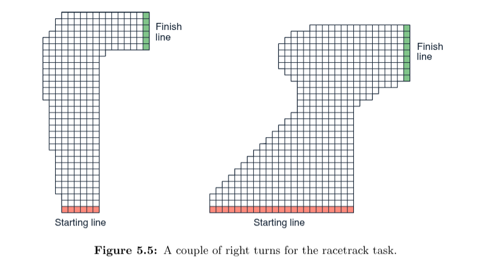
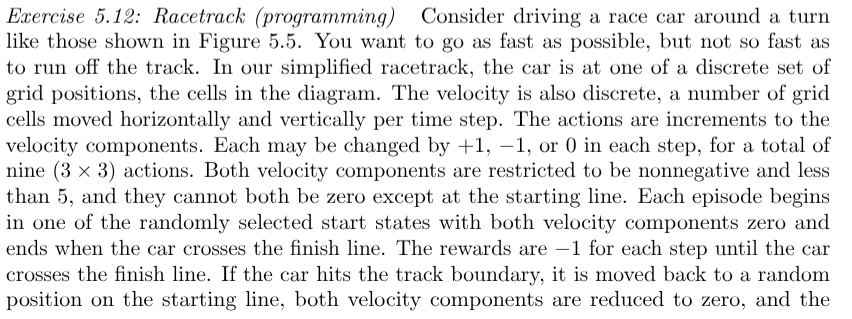
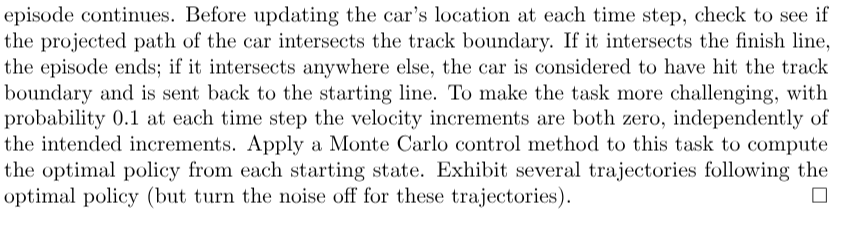
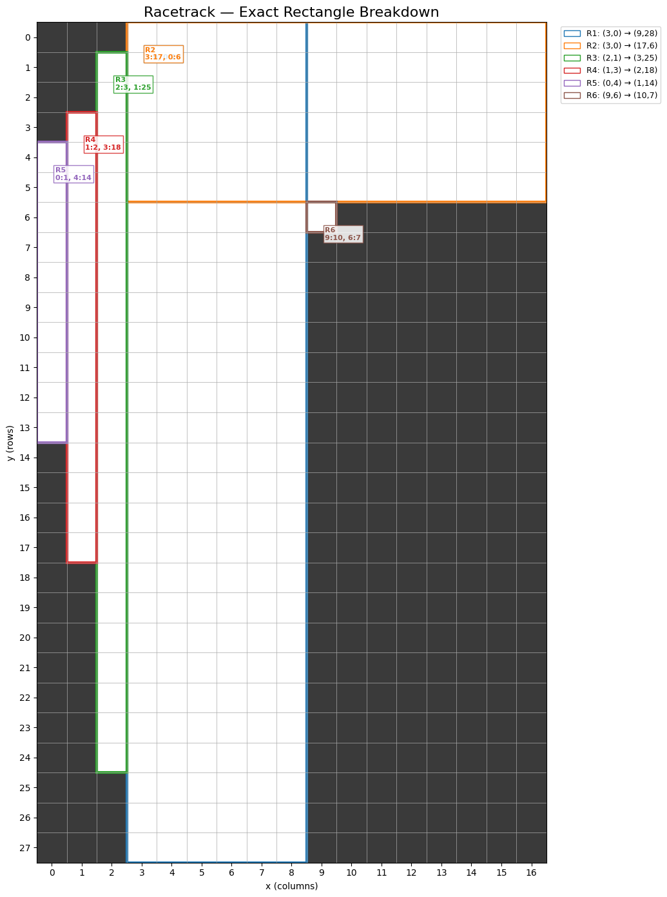
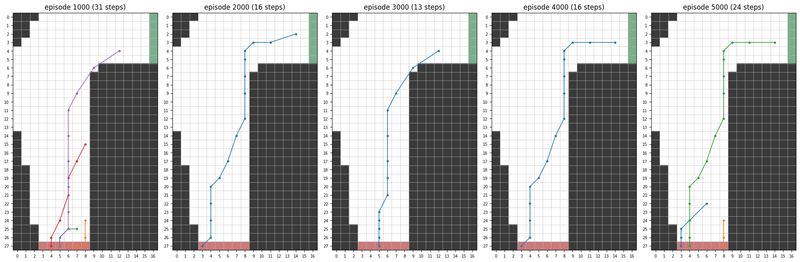
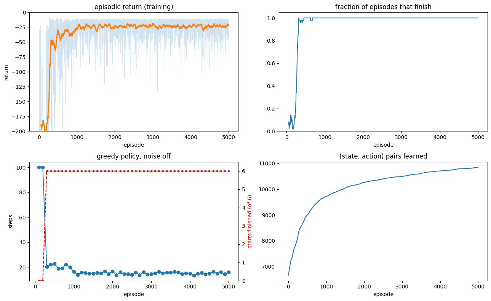

#Reinforcement Learning: An introduction by Sutton & Barto

This is my repository for solving examples by code from the book Sutton and Barto 

## Racetrack problem (Example 5.12 Monte Carlo Methods)

#### Solution: racetrack.ipynb

Firstly we build the racetrack from the book, the idea is to break down the track into 6 rectangles

Here's how to breakdown the first track into the 6 pieces

you can use similar breakdown for the second track and use that in the notebook, just replace the rectangles

I only employ On Policy Monte Carlo (first visit) yet. Would do Off policy soon!

Here's some trajectories with noise = 0.1 injected! I was thinking of increasing noise to make the policy less "hug the wall" solution

